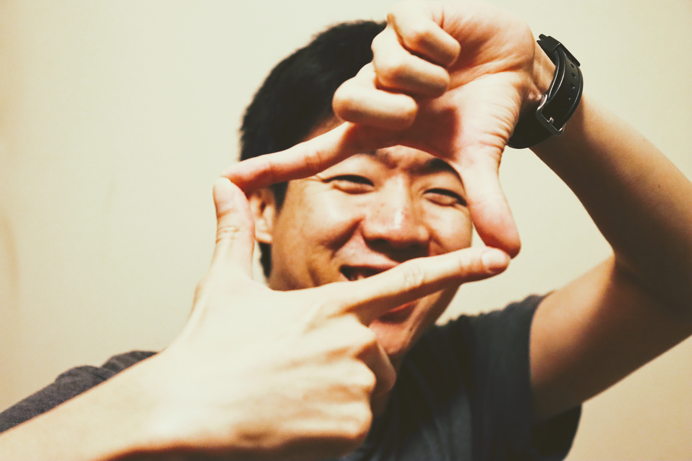

# Android Summer Bootcamp 2020

## Profile

* **Name**: Michael Sim
* **Discord Username**: TM: Mike (or `sense`)
* **Location**: Los Angeles, California, USA

I recently discovered Kotlin and I'm working hard to become an Android dev.
It's very challenging but also exciting. I'm thankful to be part of RW's
Android Bootcamp and learning a ton of things every day. I cannot wait to see
what my classmates create for their final project. I hope they'll like mine!
Outside of programming, I like to run, play music and write.
